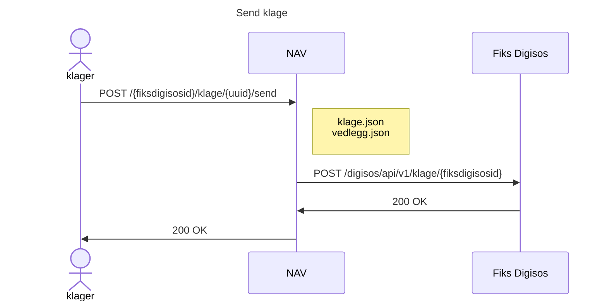
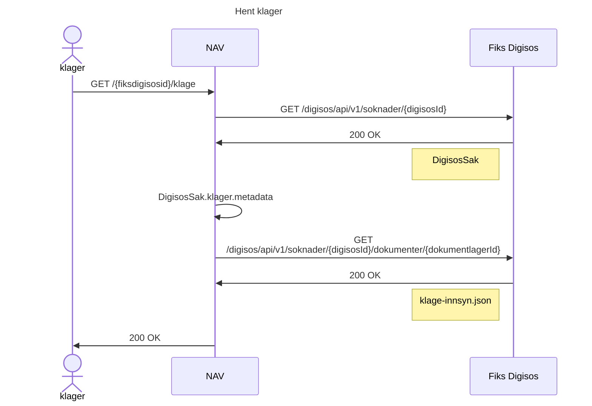
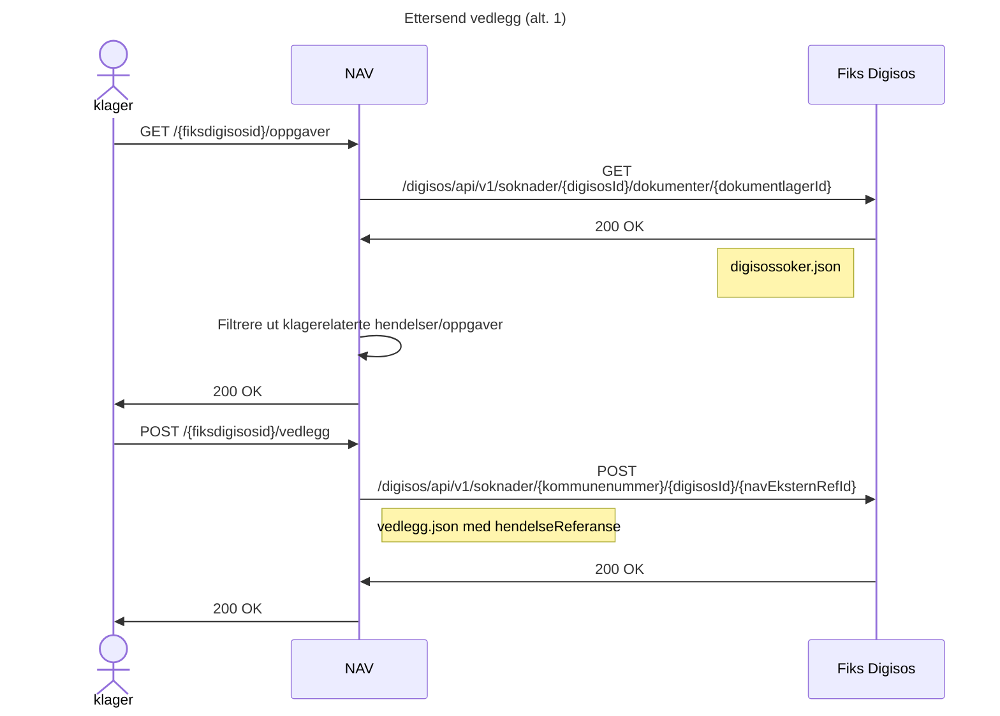
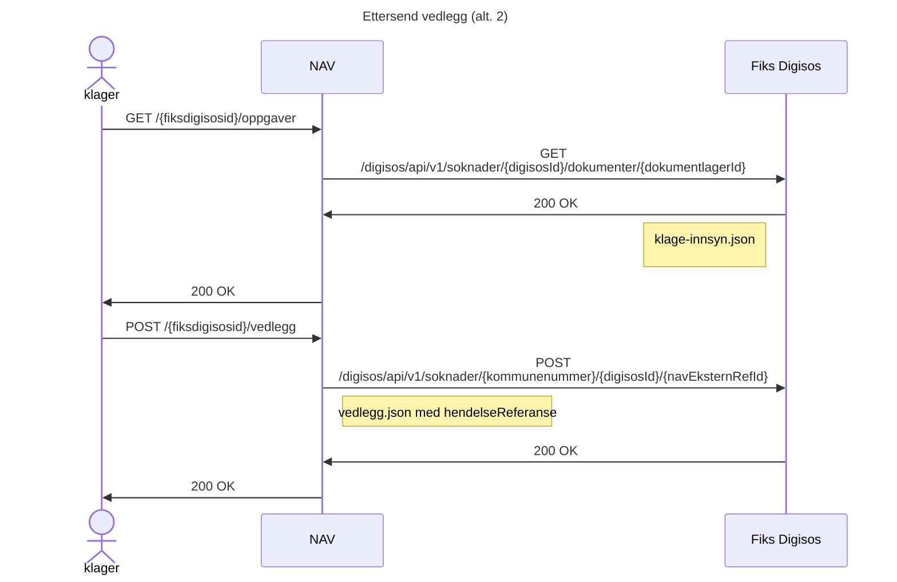
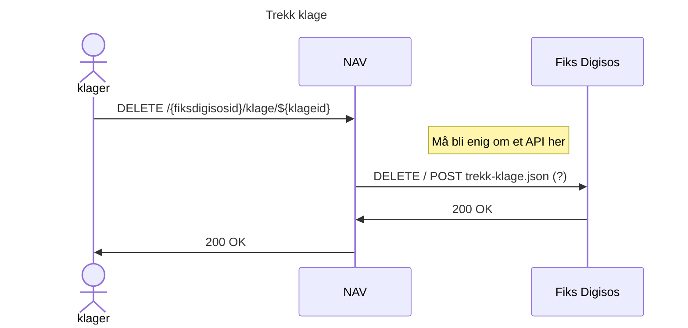
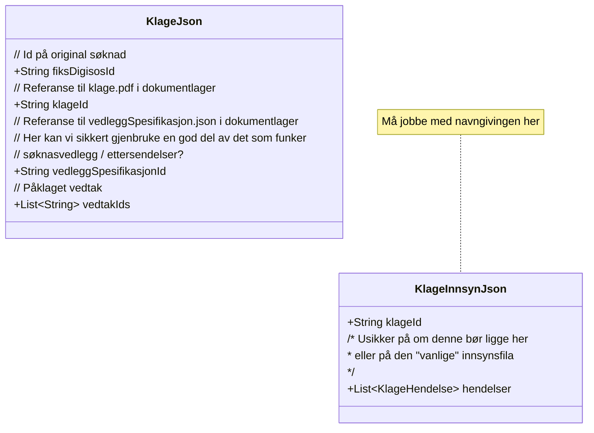

## Send klage

## Hent klager

## Ettersend vedlegg:

### Hvor skal hendelser registreres?
- Alt. 1: Legge til nye hendelsetyper i lista i DigisosSoker.json
    - Da må vi klare å kryssreferere til riktig klage i hendelsen
- Alt 2: Lage en ny liste med klagespesifikke hendelser i klage-innsyn.json
    - Da blir det enkelt å utlede nåværende status på hver klage,
    - men må inn å gjennomgå hendelser flere steder for å få totaloversikt

### Alt. 1

### Alt. 2

## Trekk klage

## Klasser (filformat)

Dette er et veldig førsteutkast av hvordan jeg tenker at filene skal se ut

