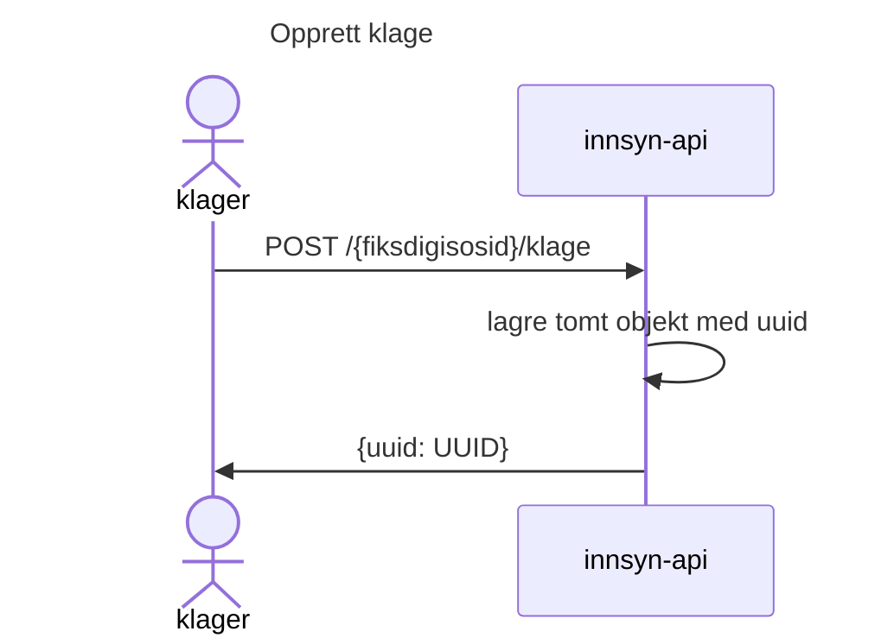
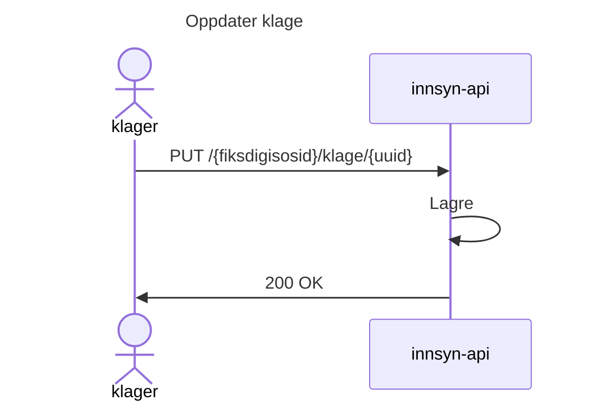
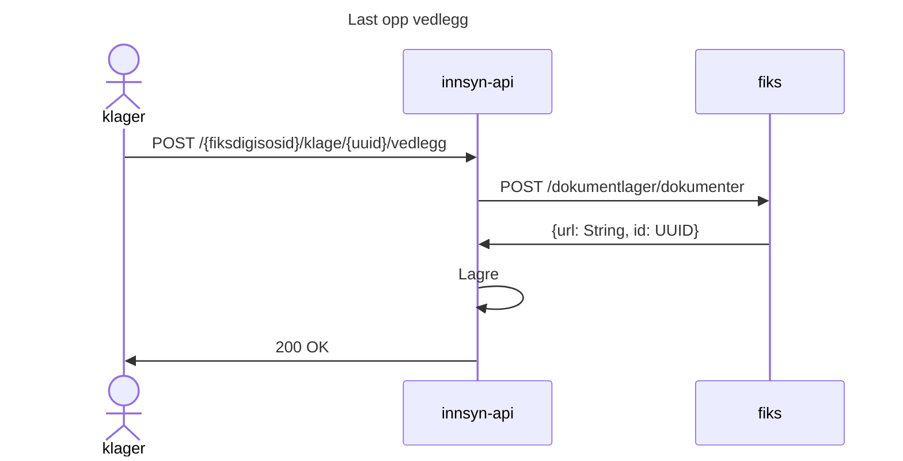
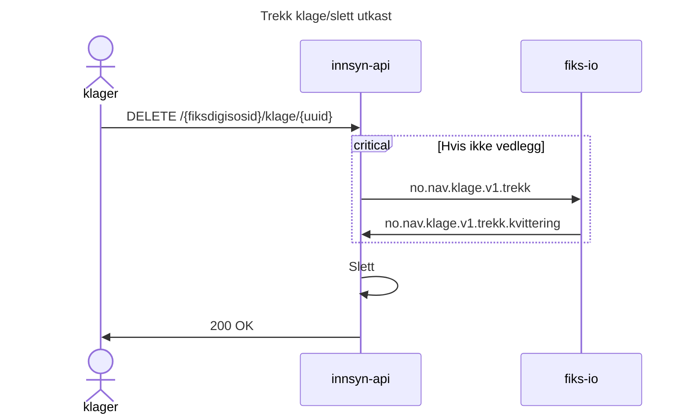
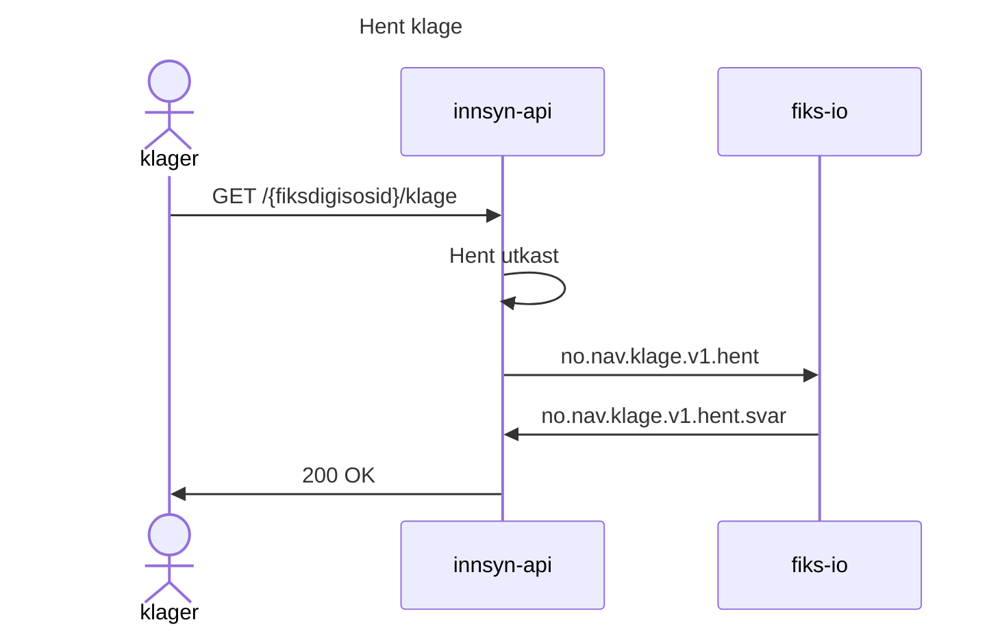
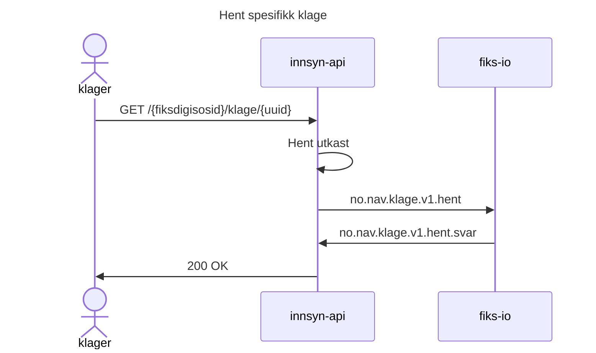
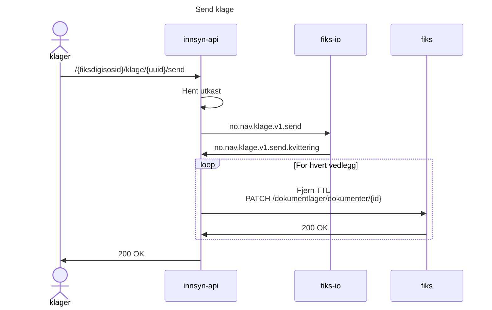

```mermaid
sequenceDiagram
    title Opprett klage
    actor klager
    participant innsyn-api
    klager->>innsyn-api: POST /{fiksdigisosid}/klage
    innsyn-api->>innsyn-api: lagre tomt objekt med uuid
    innsyn-api->>klager: {uuid: UUID}

```

```mermaid
sequenceDiagram
    title Oppdater klage
    actor klager
    participant innsyn-api
    klager->>innsyn-api: PUT /{fiksdigisosid}/klage/{uuid}
    innsyn-api->>innsyn-api: Lagre
    innsyn-api->>klager: 200 OK
```

```mermaid
sequenceDiagram
    title Last opp vedlegg
    actor klager
    participant innsyn-api
    klager->>innsyn-api: POST /{fiksdigisosid}/klage/{uuid}/vedlegg
    innsyn-api->>fiks: POST /dokumentlager/dokumenter
    fiks->>innsyn-api: {url: String, id: UUID}
    innsyn-api->>innsyn-api: Lagre
    innsyn-api->>klager: 200 OK    
```

```mermaid
sequenceDiagram
    title Trekk klage/slett utkast
    actor klager
    participant innsyn-api
    participant fiks-io
    klager->>innsyn-api: DELETE /{fiksdigisosid}/klage/{uuid}
    critical Hvis ikke vedlegg
        innsyn-api->>fiks-io: no.nav.klage.v1.trekk
        fiks-io->>innsyn-api: no.nav.klage.v1.trekk.kvittering
    end
    innsyn-api->>innsyn-api: Slett
    innsyn-api->>klager: 200 OK
```

```mermaid
sequenceDiagram
    title Hent klage
    actor klager
    participant innsyn-api
    participant fiks-io
    klager->>innsyn-api: GET /{fiksdigisosid}/klage
    innsyn-api->>innsyn-api: Hent utkast
    innsyn-api->>fiks-io: no.nav.klage.v1.hent
    fiks-io->>innsyn-api: no.nav.klage.v1.hent.svar
    innsyn-api->>klager: 200 OK
```

```mermaid
sequenceDiagram
    title Hent spesifikk klage
    actor klager
    participant innsyn-api
    participant fiks-io
    klager->>innsyn-api: GET /{fiksdigisosid}/klage/{uuid}
    innsyn-api->>innsyn-api: Hent utkast
    innsyn-api->>fiks-io: no.nav.klage.v1.hent
    fiks-io->>innsyn-api: no.nav.klage.v1.hent.svar
    innsyn-api->>klager: 200 OK
```

```mermaid
sequenceDiagram
    title Send klage
    actor klager
    participant innsyn-api
    participant fiks-io
    participant fiks
    klager->>innsyn-api: /{fiksdigisosid}/klage/{uuid}/send
    innsyn-api->>innsyn-api: Hent utkast
    innsyn-api->>fiks-io: no.nav.klage.v1.send
    fiks-io->>innsyn-api: no.nav.klage.v1.send.kvittering
    loop For hvert vedlegg
        innsyn-api->>fiks: Fjern TTL<br/>PATCH /dokumentlager/dokumenter/{id} <br/>
        fiks->>innsyn-api: 200 OK
    end
    innsyn-api->>klager: 200 OK
```
